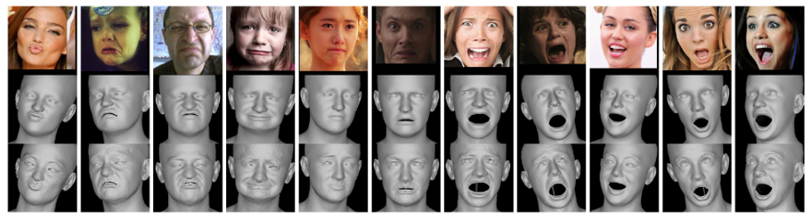

# EMOCA : Emotion-Driven Monocular Face Capture and Animation 

This is the official implementation of [EMOCA: Emotion-Driven Monocular Face Capture and Animation](https://emoca.is.tue.mpg.de/). EMOCA takes a single in-the-wild image as input and reconstructs a 3D face with sufficient facial expression detail to convey the emotional state of the
input image. 

<p align="center"> 


</p>

<p align="center"> 

</p>
<p align="center">Top row: input images. Middle row: coarse shape reconstruction. Bottom row: reconstruction with detailed displacements.<p align="center">


## !!! UPDATE !!!
**EMOCA v2 is now out.** 

Compared to the original model it produces: 

1) Much better lip and eye alignment 
2) Much better lip articulation 

This is achieved by: 
1) Using a subset of mediapipe landmarks for mouth, eyes and eyebrows (as opposed to FAN landmarks that EMOCA v1 uses)
2) Using absolute landmark loss in combination with the relative losses (as opposed to only relative landmark losses in EMOCA v1)
3) Incorporating perceptual lip reading loss. Inspired by [spectre](https://filby89.github.io/spectre/). Big shout-out to these guys!

There are now mutiple EMOCA models that you can use for reconstruction. You can specify their names in the demo scripts using the `--model_name <model>` flag. 

The available models are: 
1) `EMOCA` - the original `EMOCA version 
2) `EMOCA_v2_mp` - EMOCA v2 trained with mediapipe landmarks (instead of FAN) but without the lip reading loss
3) `EMOCA_v2_lr_cos_1.5` - EMOCA v2 trained with mediapipe landmarks and with the lip reading loss (cosine similarity on lip reading features, similarly to SPECTRE) 
4) `EMOCA_v2_lr_mse_20` - (default) EMOCA v2 trained with mediapipe landmarks and with the lip reading loss (MSE on lip reading features)

You can find the [comparison video here](https://download.is.tue.mpg.de/emoca/assets/emoca_v2_comparison.mp4)

Notes: 
The SPECTRE paper uses a cosine similarity metric on lip reading features for supervision. In practice, we found that the cosine similarity loss can sometimes be artifact prone (over-exaggerated lip motion). This is the `EMOCA_v2_lr_cos_1.5` model. We found the supervision by mean squared error metric to be more stable in this regard and hence we recommend using the `EMOCA_v2_lr_mse_20` model. If you find that even this one produces undesirable artifacts, we suggest using `EMOCA_v2_mp`, which does not use the lip reading loss but is still much better thatn the original `EMOCA` model.


## Installation 

1) Follow the steps at the [root of this repo](../..). If for some reason the environment from there is not valid, create one using a `.yml` file from `envs`.

2) In order to run the demos you will need to download and unzip a few assets. Run `download_assets.sh` to do that: 
```bash 
cd demos 
bash download_assets.sh
```
3) (Optional for inference, required for training) [Basel Face Model](https://faces.dmi.unibas.ch/bfm/bfm2019.html) texture space adapted to FLAME. Unfortunately, we are not allowed to distribute the texture space, since the license does not permit it. Therefore, please go to the [BFM page](https://faces.dmi.unibas.ch/bfm/bfm2019.html) sign up and dowload BFM. Then use the tool from this [repo](https://github.com/TimoBolkart/BFM_to_FLAME) to convert the texture space to FLAME. Put the resulting texture model file file into [`../../assets/FLAME/texture`](../../assets/FLAME/texture) as `FLAME_albedo_from_BFM.npz`


## Demos 


Then activate your environment: 
```bash
conda activate work38
```


### Single Image Reconstruction 
If you want to run EMOCA on images, run the following
```python 
python demos/test_emoca_on_images.py --input_folder <path_to_images> --output_folder <set_your_output_path> --model_name EMOCA_v2_lr_mse_20 
```
The script will detect faces in every image in the folder output the results that you specify with `--save_images`, `--save_codes`, `--save_mesh` to the output folder. 

Running this (default parameters) will use EMOCA to reconstruct faces on several test images.
```python 
python demos/test_emoca_on_images.py
```

See `demos/test_emoca_on_images.py` for further details.

### Video Reconstruction 
If you want to be able to create a video of the reconstruction (like the teaser above), just pick your favourite emotional video and run the following:
```python 
python demos/test_emoca_on_video.py --input_video <path_to_your_video> --output_folder <set_your_output_path> --model_name EMOCA_v2_lr_mse_20 
```
The script will extract the frames from the video, run face detection on it to extract cropped out faces. Then EMOCA will be run, the reconstruction renderings saved and finally a reconstruction video sequence created. Processing long videos may take some time.

Running the following (default parameters) will use EMOCA to reconstruct faces on a provided test video.
```python 
python demos/test_emoca_on_video.py
```

See `demos/test_emoca_on_video.py` for further details.

## Training 

In order to train EMOCA, you need the following things: 

<!-- 0) [Basel Face Model](https://faces.dmi.unibas.ch/bfm/bfm2019.html) texture space adapted to FLAME. Unfortunately, we are not allowed to distribute the texture space, since the license does not permit it. Therefore, please go to the [BFM page](https://faces.dmi.unibas.ch/bfm/bfm2019.html) sign up and dowload BFM. Then use the tool from this [repo](https://github.com/TimoBolkart/BFM_to_FLAME) to convert the texture space to FLAME. Put the resulting texture model file file into [`../../assets/FLAME/texture`](../../assets/FLAME/texture) as `FLAME_albedo_from_BFM.npz` -->

1) Get training data of DECA (this is crucial for training the detail stage part of EMOCA) 

2) Download AffectNet from http://mohammadmahoor.com/affectnet/ 

3) Process AffectNet using the `data/process_affectnet.py` script. (See the script for details) This dataset is crucial to train the 

5) In order to train the detailed stage, we need the "[DECA dataset](https://github.com/YadiraF/DECA)" which consists of VGGFace2, BUPT-Balanced Face and VoxCeleb images. Unfortunately, VGGFace2 is officially not available anymore and we are not allowed to distribute it. 
We are working towards switching to another face recognition dataset in place of VGGFace2 but pull requests are also welcome. We are also willing to provide assistance and advice in training EMOCA.

4) Train EMOCA. For trainng the coarse version, AffectNet is enough. In order to finetune the  detail stage you will also need the DECA dataset (or other large scale dataset that guarantees multiple images per identity)
```
python training/train_expdeca.py emoca.yaml
```


## Citation 

If you use this work in your publication, please cite the following publications:
```
@inproceedings{EMOCA:CVPR:2021,
  title = {{EMOCA}: {E}motion Driven Monocular Face Capture and Animation},
  author = {Danecek, Radek and Black, Michael J. and Bolkart, Timo},
  booktitle = {Conference on Computer Vision and Pattern Recognition (CVPR)},
  pages = {20311--20322},
  year = {2022}
}
```

As EMOCA builds on top of [DECA](https://github.com/YadiraF/DECA) and uses parts of DECA as fixed part of the model, please further cite:
```
@article{DECA:Siggraph2021,
  title={Learning an Animatable Detailed {3D} Face Model from In-The-Wild Images},
  author={Feng, Yao and Feng, Haiwen and Black, Michael J. and Bolkart, Timo},
  journal = {ACM Transactions on Graphics (ToG), Proc. SIGGRAPH},
  volume = {40}, 
  number = {8}, 
  year = {2021}, 
  url = {https://doi.org/10.1145/3450626.3459936} 
}
```
Furthermore, if you use EMOCA v2, please also cite [SPECTRE](https://filby89.github.io/spectre/): 
```
@article{filntisis2022visual,
  title = {Visual Speech-Aware Perceptual 3D Facial Expression Reconstruction from Videos},
  author = {Filntisis, Panagiotis P. and Retsinas, George and Paraperas-Papantoniou, Foivos and Katsamanis, Athanasios and Roussos, Anastasios and Maragos, Petros},
  journal = {arXiv preprint arXiv:2207.11094},
  publisher = {arXiv},
  year = {2022},
}
```


## License
This code and model are **available for non-commercial scientific research purposes** as defined in the [LICENSE](https://emoca.is.tue.mpg.de/license.html) file. By downloading and using the code and model you agree to the terms of this license. 


### Contributing 
Pull requests are welcome! Please report crashes and/or bugs.
If you run EMOCA and get interesting results (both good and bad), please let us know. 
