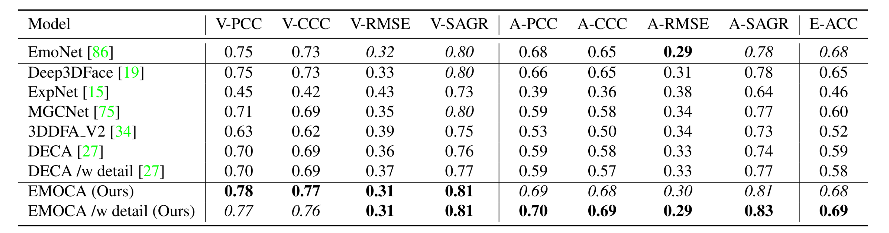

# Emotion Recognition 

This project accompanies the EMOCA release. Here we provide training and testing code for: 
- image-based emotion recognition networks 
    - EmoNet 
    - vanilla vision backbones (ResNet, VGG, SWIN)
- EMOCA-based emotion recognotion 

The provided models were trained and tested on AffectNet.

 

## Installation 
Follow the steps at the root of this repo. If for some reason the environment from there is not valid, create one using a `.yml` file from `envs`. After that you should be able to run the demos. 

## Pre-trained models 
All the provided models have been trained on AffectNet, either from scratch (the image-based backbones) or finetuned based on fixed pretrained face reconstruction nets. 

Use `download_assets.sh` to download and unzip them: 
```bash
cd demos 
bash download_assets.sh
```

Then activate your environment: 
```bash
conda activate work36_cu11
```


## Demos 

### Single-image based emotion recognition 

If you want to run Emotion Recognition on images, run the following
```bash 
python demos/test_emotion_recognition_on_images.py --input_folder <path_to_images> --output_folder <set_your_output_path>  --modeltype (image|3dmm) --model_name (ResNet50|SWIN-B|EMOCA-emorec|EMOCA_detail-emorec)
```
The script will detect faces in every image in the folder output the results that you specify with `--save_images`, `--save_codes`, `--save_mesh` to the output folder. 

For example, for inference with EMOCA run: 
```bash 
python demos/test_emotion_recognition_on_images.py --input_folder <path_to_images> --output_folder <set_your_output_path>  --modeltype 3dmm --model_name EMOCA-emorec
```

and for inference with Resnet50 run: 
```bash 
python demos/test_emotion_recognition_on_images.py --input_folder <path_to_images> --output_folder <set_your_output_path>  --modeltype image --model_name ResNet50
```

For example, running the following will run emotion recognition with EMOCA on a number of test images: 

```bash 
python demos/test_emotion_recognition_on_images.py --modeltype 3dmm --model_name EMOCA-emorec
```

See `demos/test_emotion_recognition_on_images.py` for further details.

<!-- ### Video-based emotion recognition  -->


### Training 
1. Process AffectNet data as described in [EMOCA](../EMOCA)
2. Pick one of the configuration files based on what network you want to train (`resnet50.yaml`, `emoca_coarse.yaml`, `emoca_detail.yaml`, `swin.yaml`). For EMOCA-based models, you will need to change paths to 

## Citation 
If you use this work in your publication, please cite the following publications: 
```
@inproceedings{EMOCA:CVPR:2022,
  title = {{EMOCA}: {E}motion Driven Monocular Face Capture and Animation},
  author = {Danecek, Radek and Black, Michael J. and Bolkart, Timo},
  booktitle = {Conference on Computer Vision and Pattern Recognition (CVPR)},
  pages = {},
  year = {2022}
}
```

### Contributing 
Pull requests are welcome! Please report crashes and/or bugs.
